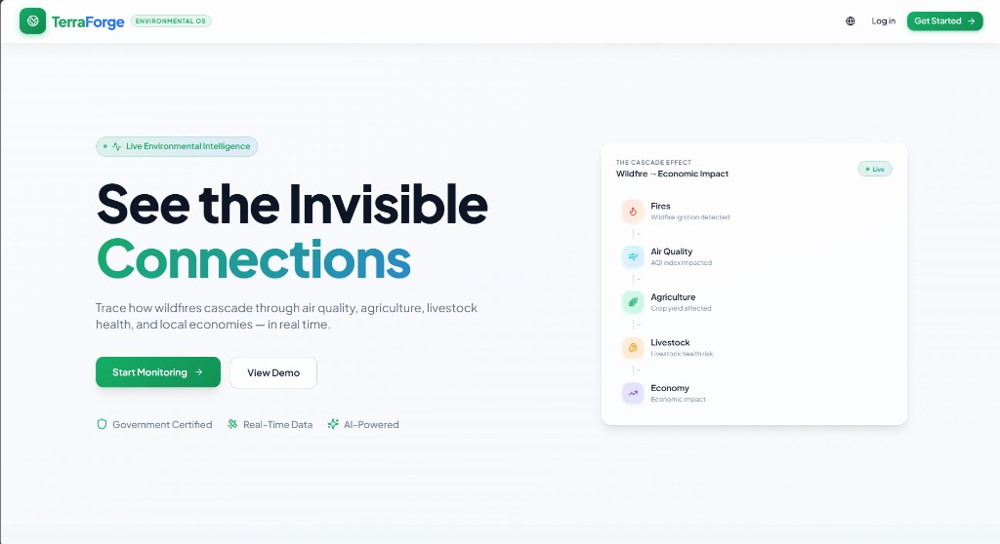
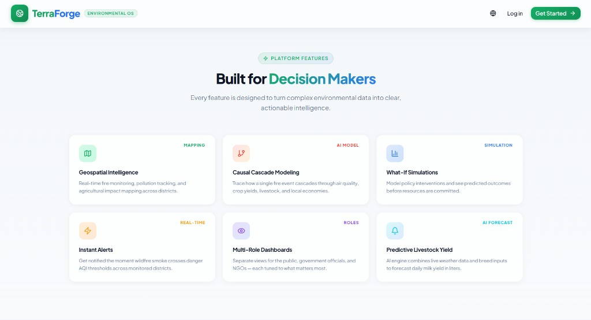
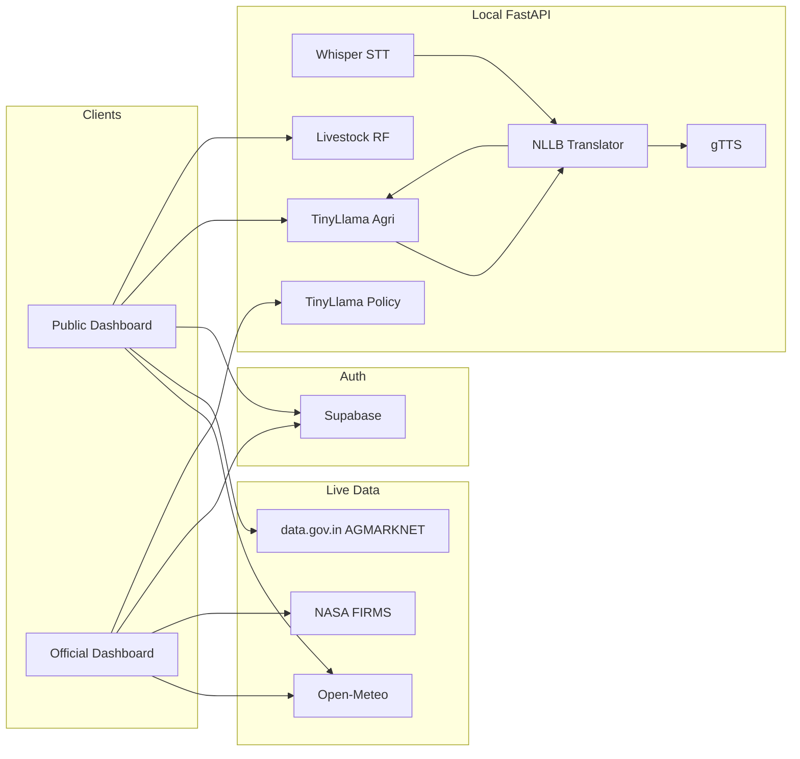

# TerraForge

**Environmental Operating System** for predicting, tracking, and mitigating the cascade effects of environmental disasters — especially wildfires — across air quality, agriculture, livestock, and local economies.

TerraForge turns live satellite, weather, and market data into role-specific dashboards and AI-assisted decisions for farmers, the public, and government officials.

## Screenshots

### Landing Page — See the Invisible Connections

Hero section of the TerraForge Environmental OS, highlighting the wildfire-to-economy cascade and primary call-to-action.



### Platform Features — Built for Decision Makers

Feature grid covering geospatial intelligence, causal cascade modeling, what-if simulations, alerts, multi-role dashboards, and predictive livestock yield.



## The Cascade Model

TerraForge is built around a single causal chain:

```
Fires → Air Quality → Agriculture → Livestock → Economy
```

A wildfire ignition is not treated as an isolated event. The platform traces how smoke raises AQI, how poor air and weather stress crops and cattle, and how those impacts show up in livelihoods and policy choices.

## Features

| Capability | Description |
| --- | --- |
| **Geospatial intelligence** | Interactive maps with live AQI, weather, and NASA FIRMS fire detections |
| **Causal cascade modeling** | End-to-end view from fire ignition through economic impact |
| **Multi-role dashboards** | Separate experiences for the public/farmers and government officials |
| **AI agricultural advisory** | Multilingual text (and optional voice) consultation via local LLMs |
| **Livestock yield forecast** | Random Forest + agri LLM explanation from AQI, rain, weight, and feed |
| **Policy simulation** | What-if policy generation for officials (strict / moderate / advisory) |
| **Live mandi prices** | AGMARKNET market data via data.gov.in |
| **Intelligence reports** | PDF export of metrics, simulations, and recommendations |
| **Regional i18n** | English, Hindi, Gujarati, Marathi, and Bengali, with IP-based language hints |

## Tech Stack

### Frontend (`frontend/`)

- **React 18** + **TypeScript** + **Vite**
- **React Router** for auth and dashboard routes
- **Tailwind CSS** + **shadcn/ui** + **Framer Motion**
- **Leaflet** / **react-leaflet** for maps
- **Recharts** for charts
- **i18next** for localization
- **Supabase Auth** for login / register
- **TanStack Query**, **jsPDF**, **html2canvas**

### Backend (`backend/`)

- **FastAPI** + **Uvicorn** (local AI API on port `8000`)
- **PyTorch** + **Transformers** + **PEFT** (LoRA adapters)
- **TinyLlama-1.1B** for policy and agricultural reasoning
- **NLLB-200 (600M)** for Indian-language translation
- **Whisper** (multilingual agricultural STT, optional)
- **scikit-learn** Random Forest for livestock yield
- **gTTS** for spoken responses

### External data sources

- [Open-Meteo](https://open-meteo.com/) — weather and air quality
- [NASA FIRMS](https://firms.modaps.eosdis.nasa.gov/) — near-real-time fire detections
- [data.gov.in AGMARKNET](https://www.data.gov.in/) — mandi prices
- [Supabase](https://supabase.com/) — authentication

## Project Structure

```
TerraForge/
├── frontend/                 # Vite + React web app
│   ├── src/
│   │   ├── api/              # Mandi prices, translations, place data
│   │   ├── components/       # Landing, dashboard, UI primitives
│   │   ├── pages/
│   │   │   ├── Landing.tsx
│   │   │   ├── auth/         # Login, Register
│   │   │   └── dashboard/    # Public + Govt Official views
│   │   ├── App.tsx
│   │   └── i18n.ts
│   ├── .env.example
│   └── package.json
├── backend/
│   ├── run_local_api.py      # FastAPI entrypoint
│   ├── requirements.txt
│   ├── scripts/
│   │   ├── train_policy_llm.py
│   │   ├── train_livestock_regression.py
│   │   └── data_cleaning/
│   └── models/               # Local weights (gitignored)
├── docs/
│   └── images/               # README screenshots
├── .gitignore
└── README.md
```

## Roles & Routes

| Role | Route | Purpose |
| --- | --- | --- |
| Public / Farmer | `/dashboard/public` | Weather & alerts, AI advisory, mandi prices, livestock yield |
| Government Official | `/dashboard/official` | Live command center, fire map, policy simulation, PDF reports |

Auth routes:

- `/` — landing page
- `/auth/login`
- `/auth/register`

Demo role mapping: signing in as `admin@gmail.com` routes to the official dashboard; other accounts use the public dashboard.

## Prerequisites

- **Node.js** 18+ and npm
- **Python** 3.10+ (3.11 recommended)
- **CUDA GPU** recommended for local LLMs (CPU works for lighter models; policy/agri LLMs are heavy)
- Supabase project (URL + anon key)
- Optional: [data.gov.in](https://www.data.gov.in/) API key for mandi prices

## Quick Start

### 1. Frontend

```bash
cd frontend
cp .env.example .env
# Edit .env with your keys (see Environment Variables)
npm install
npm run dev
```

App runs at `http://localhost:5173` by default.

### 2. Backend (local AI API)

```bash
cd backend
python -m venv .venv

# Windows
.venv\Scripts\activate

# macOS / Linux
source .venv/bin/activate

pip install -r requirements.txt
```

Place trained / downloaded models under `backend/models/` (see [Models](#models)). Update `MODELS_DIR` in `run_local_api.py` if your path differs from the default.

```bash
python run_local_api.py
```

API listens on `http://localhost:8000`.

Point the frontend at it (optional; this is the default):

```env
VITE_LOCAL_AI_API=http://localhost:8000
```

> The UI still works for maps, weather, and mandi data without the backend. AI advisory, yield forecast, and policy generation require the FastAPI server and loaded models.

## Environment Variables

Create `frontend/.env` from `.env.example`:

| Variable | Description |
| --- | --- |
| `VITE_SUPABASE_URL` | Supabase project URL |
| `VITE_SUPABASE_ANON_KEY` | Supabase anon/public key |
| `VITE_DATA_GOV_API_KEY` | data.gov.in API key for AGMARKNET mandi prices |
| `VITE_LOCAL_AI_API` | Local FastAPI base URL (default `http://localhost:8000`) |

Do not commit real secrets. `.env` is gitignored.

## Local AI API

Health check:

```http
GET /
```

| Endpoint | Method | Description |
| --- | --- | --- |
| `/api/agriculture/consult` | `POST` | Text advisory: NLLB → TinyLlama agri → NLLB (+ TTS) |
| `/api/agriculture/voice` | `POST` | Voice advisory: Whisper → same pipeline as consult |
| `/api/yield/forecast` | `POST` | Livestock yield (RF) + natural-language insight |
| `/api/policy/generate` | `POST` | Policy simulation JSON for government scenarios |

### Example: livestock yield

```bash
curl -X POST http://localhost:8000/api/yield/forecast \
  -H "Content-Type: application/json" \
  -d "{\"features\":{\"aqi\":220,\"rain\":12,\"weight\":550,\"feed\":18}}"
```

### Example: policy generation

```bash
curl -X POST http://localhost:8000/api/policy/generate \
  -H "Content-Type: application/json" \
  -d "{\"scenario\":\"Severe stubble burning across Punjab with AQI above 400\"}"
```

## Models

Model weights and datasets are **not** tracked in git (see `.gitignore`). Expected layout under `backend/models/`:

| Path | Role |
| --- | --- |
| `nllb_600m/` | Multilingual translation (NLLB-200 distilled 600M) |
| `whisper-multilingual-agricultural-v1/` | Speech-to-text for voice advisory |
| `tinyllama-policy-v1/` | LoRA adapter for policy simulation |
| `tinyllama-agricultural-v1/` | LoRA adapter for agri consultation / yield narrative |
| `livestock_yield_rf_model.pkl` | Random Forest milk-yield regressor |

### Training scripts

From `backend/` (after installing requirements and preparing datasets):

```bash
# Livestock yield Random Forest (synthetic data built into the script)
python scripts/train_livestock_regression.py

# Policy LLM (QLoRA on TinyLlama; requires a policy JSONL dataset)
python scripts/train_policy_llm.py
```

Training scripts may contain absolute paths from the original development machine — update `MODELS_DIR`, dataset paths, and output directories before running.

## Frontend Scripts

```bash
cd frontend
npm run dev       # development server
npm run build     # production build
npm run preview   # preview production build
npm run lint      # ESLint
npm run test      # Vitest
```

## Architecture Overview



## Notes

- Large artifacts (`*.pt`, `*.pkl`, `*.safetensors`, CSVs, `backend/models/`) are intentionally excluded from version control.
- Policy and agri LLMs expect GPU memory for comfortable inference; NLLB is loaded on CPU by default in the API.
- Official dashboard fire layers use NASA FIRMS; ensure network access to FIRMS and Open-Meteo endpoints.

## License

This project is provided as-is for hackathon and research use. Add a license file if you plan to distribute it publicly.
